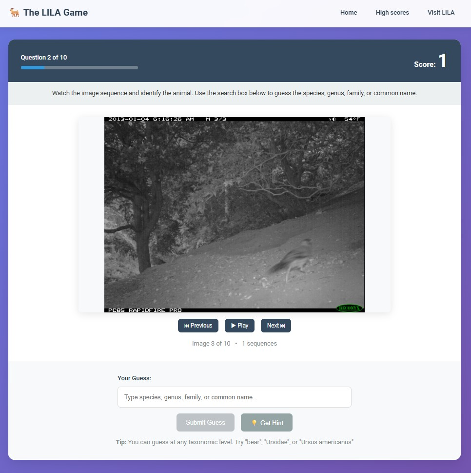
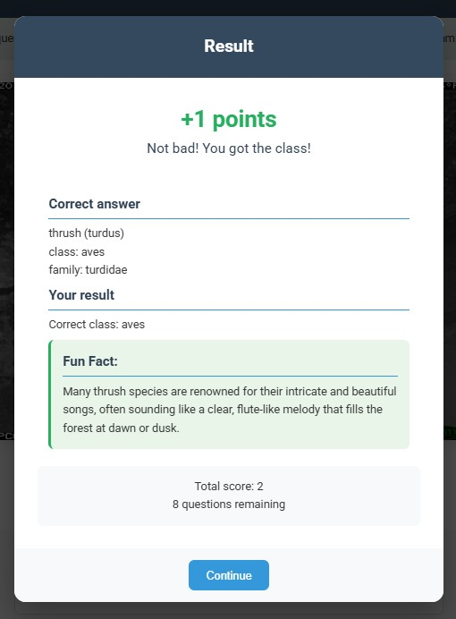

# The LILA Game

## Overview

The LILA Game is an interactive web-based wildlife identification game that uses real camera trap images from conservation research projects. Players view sequences of wildlife images and challenge themselves to identify the animals at various taxonomic levels - from species to family to order.



**Key Features:**
- Real camera trap image sequences from wildlife research
- Hierarchical scoring system (10 points for species, 5 for genus, 3 for family, etc.)
- Autocomplete search supporting both scientific and common names
- AI-generated hints and "fun facts"
- High score leaderboard
- Responsive web interface optimized for learning

The game serves as both an educational tool for wildlife identification and a fun way to test your knowledge of animal taxonomy. Whether you're a wildlife enthusiast, student, or researcher, the game adapts to your knowledge level - you can guess broadly (family) or specifically (species) and still earn points.

Built using real data from camera trap research projects, this game connects players with ongoing wildlife conservation efforts while building taxonomic knowledge and identification skills.

## Quick Start

1. **Install dependencies**:
   ```bash
   pip install -r requirements.txt
   ```

2. **Initialize database**:
   ```bash
   python db_setup.py
   ```

3. **Populate database from CSV**:
   ```bash
   python data_processor.py --csv-path /path/to/your/camera-trap-data.csv
   ```

4. **Run the application**:
   ```bash
   python app.py
   ```

5. **Open browser**: Navigate to `http://localhost:5000`

## Detailed Setup Instructions

### Prerequisites

- Python 3.7 or higher
- At least 2GB available disk space (for database)
- Your wildlife camera trap CSV file

### Installation

1. **Clone or download the project files**:
   ```bash
   # Ensure all project files are in your working directory
   ls
   # Should show: app.py, models.py, game_logic.py, data_processor.py, etc.
   ```

2. **Create virtual environment (recommended)**:
   ```bash
   python -m venv wildlife-game-env
   source wildlife-game-env/bin/activate  # Linux/Mac
   # or
   wildlife-game-env\Scripts\activate     # Windows
   ```

3. **Install Python dependencies**:
   ```bash
   pip install -r requirements.txt
   ```

### Database Setup

#### Step 1: Initialize Database Schema
```bash
python db_setup.py
```

This creates `camera_trap_data.db` with the required tables:
- `taxa` - Unique taxonomic combinations
- `sequences` - Camera trap image sequences  
- `images` - Individual image metadata
- `high_scores` - Game leaderboard

#### Step 2: Process CSV Data
```bash
python data_processor.py --csv-path /path/to/your/camera-trap-data.csv
```

**Important**: Use the exact path to your CSV file. For example:
```bash
# If CSV is in the same directory:
python data_processor.py --csv-path ./camera_trap_data.csv

# If CSV is elsewhere:
python data_processor.py --csv-path /home/user/data/camera_trap_data.csv
```

**Processing Details**:
- Filters out non-wildlife images (blank taxonomy columns)
- Creates unique taxa entries
- Groups images into sequences
- Can take 10-30 minutes for large CSV files
- Shows progress updates during processing

#### Step 3: Verify Database Population
```bash
python -c "
import sqlite3
conn = sqlite3.connect('camera_trap_data.db')
cursor = conn.cursor()
cursor.execute('SELECT COUNT(*) FROM taxa')
taxa_count = cursor.fetchone()[0]
cursor.execute('SELECT COUNT(*) FROM sequences') 
seq_count = cursor.fetchone()[0]
cursor.execute('SELECT COUNT(*) FROM images')
img_count = cursor.fetchone()[0]
print(f'Database populated with:')
print(f'  Taxa: {taxa_count:,}')
print(f'  Sequences: {seq_count:,}')
print(f'  Images: {img_count:,}')
conn.close()
"
```

### Running the Application

#### Development Mode
```bash
python app.py
```
- Runs on `http://localhost:5000`
- Debug mode enabled
- Auto-reloads on code changes

#### Production Mode (Ubuntu VM)
```bash
# Install gunicorn
pip install gunicorn

# Run with gunicorn
gunicorn -w 4 -b 0.0.0.0:8000 app:app
```
- Runs on all interfaces port 8000
- 4 worker processes
- Better performance and stability

### AI Features Setup (Optional)

For hints and fun facts features:

1. **Get Gemini API key** from [Google AI Studio](https://makersuite.google.com/app/apikey)

2. **Provide the API key** using one of these methods (in order of priority):

   **Option A: Environment Variable**
   ```bash
   export GEMINI_API_KEY="your-api-key-here"
   ```

   **Option B: .env File**
   Create a `.env` file in the project root:
   ```
   GEMINI_API_KEY=your-api-key-here
   ```

   **Option C: .gemini-key File**
   Create a `.gemini-key` file in the project root:
   ```
   your-api-key-here
   ```

3. **Restart the application** - AI features will now be available:
   - **Hints**: Click the "💡 Get Hint" button during gameplay for identification clues
   - **Fun Facts**: Automatically generated facts appear after each correct identification

**Note**: Add `.env` and `.gemini-key` to your `.gitignore` file to avoid committing API keys to version control.

## Configuration Options

### Game Settings (app.py)
```python
# Modify these variables in app.py:
QUESTIONS_PER_GAME = 10    # Number of taxa per game
SEQUENCES_PER_QUESTION = 4  # Image sequences shown per question
IMAGE_CLOUD_PREFERENCE = 'gcp'  # 'gcp', 'aws', or 'azure'
```

### Database Location
```python
# In models.py, change DATABASE_PATH if needed:
DATABASE_PATH = 'camera_trap_data.db'
```

## Usage Guide

### Playing the Game

1. **Start Game**: Click "Start New Game" on homepage
2. **View Images**: 
   - Images auto-play at ~1fps (toggle with play/pause)
   - Use Previous/Next buttons for manual control
   - View all sequences as many times as needed
3. **Make Guess**: 
   - Type in the search box for autocompletion
   - Scientific names and common names both supported
   - Select from dropdown or type exact match
4. **Submit**: Click "Submit Guess" when ready
5. **See Results**: View correct answer, points earned, and fun fact
6. **Continue**: Complete all 10 questions for final score
7. **High Scores**: Enter name if you achieve top 10 score

### Scoring System
- **Species/Subspecies/Variety**: 10 points
- **Genus**: 5 points  
- **Family**: 3 points
- **Order and higher**: 1 point

Points awarded for the highest taxonomic level that matches.

## Troubleshooting

### Common Issues

#### "No module named 'flask'"
```bash
pip install -r requirements.txt
```

#### "Database file not found"
```bash
# Run database setup first:
python db_setup.py
```

#### "No data found" during CSV processing
- Check CSV file path is correct
- Ensure CSV has the expected column headers
- Verify CSV contains wildlife data (non-blank taxonomy columns)

#### Images not loading
- Check internet connection (images hosted on cloud)
- Verify CSV contained valid image URLs
- Try changing `IMAGE_CLOUD_PREFERENCE` in app.py

#### High memory usage
- Large databases may use significant RAM
- Consider upgrading VM if processing very large datasets
- Monitor with `htop` or similar during CSV processing

### Performance Optimization

#### Slow autocompletion
```sql
-- Add additional indexes if needed:
sqlite3 camera_trap_data.db
CREATE INDEX idx_taxa_search ON taxa(common_name, most_specific_name);
```

#### Slow game loading
```python
# In models.py, increase cache size:
conn.execute('PRAGMA cache_size = 10000')
```

### Log Files

Check application logs for detailed error information:
```bash
# Run with logging:
python app.py 2>&1 | tee app.log
```

## Development

### File Structure
```
wildlife-game/
├── app.py              # Main Flask application
├── models.py           # Database models and queries  
├── game_logic.py       # Game mechanics and scoring
├── data_processor.py   # CSV to database conversion
├── db_setup.py         # Database initialization
├── requirements.txt    # Python dependencies
├── design.md          # System specification
├── README.md          # This file
├── camera_trap_data.db # Generated SQLite database
├── templates/         # HTML templates
│   ├── base.html
│   ├── index.html
│   ├── question.html
│   ├── result.html
│   └── high_scores.html
└── static/           # CSS, JavaScript, images
    ├── style.css
    └── game.js
```

### Adding Features

1. **Modify game parameters**: Edit variables in `app.py`
2. **Change scoring**: Update `SCORE_VALUES` in `game_logic.py`
3. **Customize UI**: Edit templates in `templates/` and styles in `static/`
4. **Add API integrations**: Extend `game_logic.py` with new functions

### Testing

```bash
# Test with small dataset first:
python data_processor.py --csv-path small_sample.csv

# Verify game flow:
python app.py
# Navigate through a complete game manually
```

## Support

For issues with this implementation:
1. Check the troubleshooting section above
2. Verify your CSV file format matches the expected schema
3. Ensure all dependencies are installed correctly
4. Check that you have sufficient disk space and memory

The system is designed to be simple and robust, but wildlife camera trap data can be complex. If you encounter issues with your specific dataset, the most common cause is unexpected data formatting in the CSV file.

## Next Steps

The following features would enhance the game experience and are planned for future development:

### Easy & High Impact
- **Game Customization**: Allow users to choose number of questions (5, 10, 15, 20) before starting
- **Difficulty Levels**: "Species Only" vs "All Levels" modes (restrict to species-level targets vs allow family/genus)
- **Session Statistics**: Track personal stats in localStorage (games played, average score, best score, favorite taxa)
- **Simple Achievements**: "First Perfect Game", "10 Games Played", "Wildlife Expert" (avg >7 pts/question)

### Image & Interface Enhancements
- **Image Zoom**: Click to zoom functionality for examining details
- **Speed Controls**: Auto-play speed controls (0.5x, 1x, 2x speed)
- **Keyboard Shortcuts**: Space = play/pause, arrows = navigation, Enter = submit
- **Sound Effects**: Subtle audio feedback for correct/incorrect answers
- **Better Loading States**: Progress indicators during image loading

### Game Modes
- **Practice Mode**: No scoring, shows answers immediately for learning
- **Speed Mode**: Time limits per question with bonus points for quick answers
- **Themed Games**: Filter by major taxonomic groups ("Mammals Only", "Birds Only")
- **Challenge of the Day**: Same 10 taxa for all players on a given day

### Social & Sharing
- **Shareable Score Cards**: Generate images with score and stats for sharing
- **Enhanced Leaderboards**: Weekly/monthly boards, regional competitions

### Educational Features
- **Post-Answer Learning**: Show 2-3 similar species with distinguishing features
- **Image Metadata**: Display location, date, and camera trap information when available

### Data & Search Improvements
- **Enhanced Autocomplete**: Support inferred taxonomic levels (e.g., allow "primates" even if not explicitly labeled in database, but primates exist at species level)
- **Geographic Context**: 
  - Ingest dataset names from original CSV files
  - Map dataset names to countries/continents using lookup table
  - Display geographic context for each image sequence

### LLM-Powered Features
- **Hints System**: AI-generated hints about distinctive features to look for
- **Fun Facts**: Interesting information about correctly identified species
- **Explanation Engine**: AI explanations of why certain guesses were close or distant

These features range from simple UI improvements to more complex data integration and AI-powered educational enhancements. Implementation priority should focus on high-impact, easy-to-implement features first, followed by more sophisticated learning aids.

## Bonus screenshots


