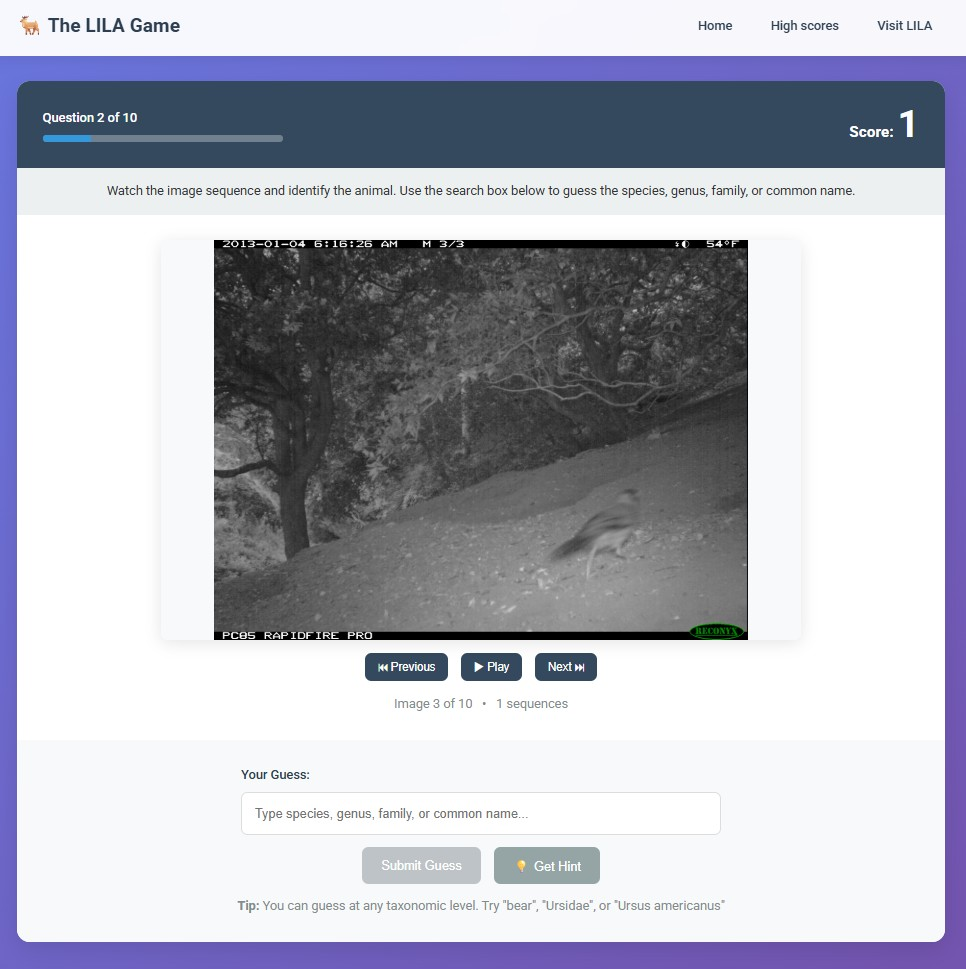
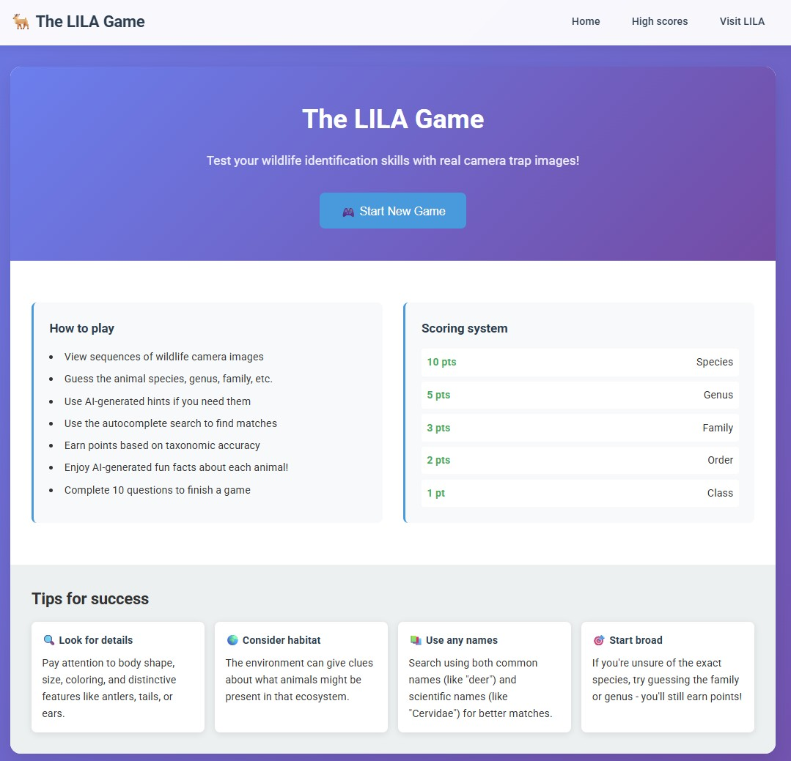
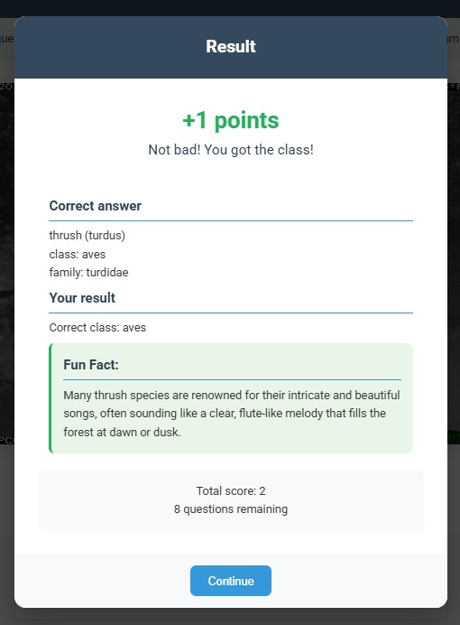

# The LILA Game

## Overview

The LILA Game is an interactive web-based wildlife identification game that uses real camera trap images from conservation research projects. Players view sequences of wildlife images and challenge themselves to identify the animals at various taxonomic levels - from species to family to order.



It's extremely likely (but not guaranteed) that at the time you're reading this, an instance of the LILA Game is running [here](https://dmorris.net/lila-game).

## Key features

- Real camera trap image sequences from wildlife research
- Hierarchical scoring system (10 points for species, 5 for genus, 3 for family, etc.)
- Autocomplete search supporting both scientific and common names
- AI-generated hints and "fun facts"
- High score leaderboard
- Responsive web interface optimized for learning

The game serves as both an educational tool for wildlife identification and a fun way to test your knowledge of animal taxonomy. Whether you're a wildlife enthusiast, student, or researcher, the game adapts to your knowledge level - you can guess broadly (family) or specifically (species) and still earn points.

Built using real data from camera trap research projects, this game connects players with ongoing wildlife conservation efforts while building taxonomic knowledge and identification skills.

## Local setup

### Clone or download the project files

```bash
https://github.com/agentmorris/lila-game
```

### Install dependencies

```bash
pip install -r requirements.txt
```

### Initialize database
   
```bash
python db_setup.py
```

This creates `camera_trap_data.db` with the required tables:
- `taxa` - Unique taxonomic combinations
- `sequences` - Camera trap image sequences  
- `images` - Individual image metadata
- `high_scores` - Game leaderboard

### Populate database from CSV

```bash
python data_processor.py --csv-path /path/to/your/camera-trap-data.csv
```

- Filters out non-wildlife images (blank taxonomy columns)
- Creates unique taxa entries
- Groups images into sequences
- Can take 10-30 minutes for large CSV files
- Shows progress updates during processing

### Run the application

```bash
python app.py
```

- Runs on `http://localhost:5000`
- Debug mode enabled
- Auto-reloads on code changes

### Open browser

Navigate to `http://localhost:5000`

## Linux deployment (non-Docker)

Keeping this here for posterity, but this is not how I actually deploy the application; I use Docker.

```bash
# Install gunicorn
pip install gunicorn

# Run with gunicorn
gunicorn -w 4 -b 0.0.0.0:8000 app:app
```
- Runs on all interfaces port 8000
- 4 worker processes
- Better performance and stability

## Linux deployment (Docker)

### Prerequisites

#### Install Docker and Docker Compose on Ubuntu

```bash
# Update package index
sudo apt update

# Install Docker
sudo apt install -y docker.io docker-compose

# Start and enable Docker
sudo systemctl start docker
sudo systemctl enable docker

# Add your user to docker group (logout/login required)
sudo usermod -aG docker $USER
```

#### Open required ports

```bash
# Open port 5001 (or your chosen port) in UFW firewall
sudo ufw allow 5001

# If using iptables instead:
sudo iptables -A INPUT -p tcp --dport 5001 -j ACCEPT
   ```

### Deployment steps

#### Copy project files to your server

```bash
# Using scp from your local machine:
scp -r lila-game/ user@your-server-ip:/home/user/

# Or clone if using git:
git clone your-repo-url lila-game
cd lila-game
```

#### Set up database and configuration

```bash
# Ensure data directory exists
mkdir -p data

# Copy your populated database if you have one
cp camera_trap_data.db data/

# Set up environment variables
cp .env.example .env
vi .env  # Add your Gemini API key

# Optional: Set up Gemini model preference
echo "gemini-1.5-flash" > .gemini-config
```

#### Deploy with Docker

```bash
# Build and start the application
docker-compose up -d --build

# View logs to ensure it's running
docker-compose logs -f
```

Note to self: the .env file is read during the build step, but not copied to the running image.  The (very large) .db file is accessed via a "bind mount", i.e., unlike other files, the database is <i>not</i> copied to magical-Docker-land, the .db file is shared between the host file system and the Docker container.

#### Verify deployment

```bash
# Check if the container is running
docker-compose ps

# Test the application
curl http://localhost:5001/

# Or test from another machine
curl http://your-server-ip:5001/
   ```

#### Access your application

- Local: `http://your-server-ip:5001`
- Domain: `http://yourdomain.com:5001`

### Managing the deployment

#### Stop the application

```bash
docker-compose down
```

#### Update and restart

```bash
# Pull latest changes (if using git)
git pull

# Rebuild and restart
docker-compose down
docker-compose up -d --build
```

#### View logs

```bash
# View current logs
docker-compose logs

# Follow logs in real-time
docker-compose logs -f
```

#### Change the port

Edit `docker-compose.yml` and change the port mapping:
```yaml
ports:
  - "5002:5001"  # This would make it accessible on port 5002
```

#### Database management

```bash
# Access the database directly
docker-compose exec lila-game sqlite3 /app/data/camera_trap_data.db

# Backup the database
docker-compose exec lila-game cp /app/data/camera_trap_data.db /app/data/backup-$(date +%Y%m%d).db

# Clear high scores (for testing/reset)
sqlite3 data/camera_trap_data.db "DELETE FROM high_scores;"

# View current high scores
sqlite3 data/camera_trap_data.db "SELECT player_name, score, game_date FROM high_scores ORDER BY score DESC;"

# Check database stats
sqlite3 data/camera_trap_data.db "SELECT COUNT(*) as taxa_count FROM taxa; SELECT COUNT(*) as scores_count FROM high_scores;"
```

#### Running alongside Apache

1. **The app runs on port 5001 by default** (separate from Apache's 80/443)
2. **Users access it directly**: `yourdomain.com:5001`
3. **Set up Apache reverse proxy** to serve it on a subdirectory path:

   ```apache
   # In your existing Apache virtual host config
   <VirtualHost *:80>
       ServerName yourdomain.com
       
       # Your existing configuration...
       
       # LILA Game proxy
       ProxyPass /lila-game http://localhost:5001/
       ProxyPassReverse /lila-game http://localhost:5001/
       ProxyPreserveHost On
   </VirtualHost>
   ```
   
   ```bash
   # In your .env file:
   APPLICATION_ROOT=/lila-game
   ```
   
   **Access:** `yourdomain.com/lila-game`

#### Deployment troubleshooting

**Port already in use:**

```bash
# Check what's using port 5001
sudo netstat -tlnp | grep :5001

# Change port in docker-compose.yml if needed
```

**Database issues:**

```bash
# Check if database file exists and is readable
docker-compose exec lila-game ls -la /app/data/

# Check database contents
docker-compose exec lila-game sqlite3 /app/data/camera_trap_data.db "SELECT COUNT(*) FROM taxa;"
```

**AI features not working:**

```bash
# Check API key configuration
docker-compose exec lila-game cat /app/.gemini-key

# Check logs for API errors
docker-compose logs | grep -i gemini
```

**Container won't start:**

```bash
# Check detailed logs
docker-compose logs lila-game

# Check container status
docker-compose ps
```

#### Deployment health monitoring

```bash
# Check if application is responding
curl http://localhost:5001/

# Monitor resource usage
docker-compose exec lila-game top

# Check disk usage
docker-compose exec lila-game df -h
```

#### Log analysis

```bash
# Search for errors
docker-compose logs | grep -i error

# Monitor AI API calls
docker-compose logs | grep -i "DEBUG.*gemini"

# Check game activity
docker-compose logs | grep -i "new game\|submit_answer"
```

#### AI API performance

```bash
# Use faster model for better response times
echo "gemini-1.5-flash" > .gemini-config

# Monitor API response times in logs
docker-compose logs | grep "API response status"
```

#### Backup strategy

```bash
#!/bin/bash
# Daily backup script
DATE=$(date +%Y%m%d)
docker-compose exec lila-game cp /app/data/camera_trap_data.db /app/data/backup-$DATE.db
```

#### Recovery

```bash
# Restore from backup
cp data/backup-YYYYMMDD.db data/camera_trap_data.db
docker-compose restart
```

## AI setup

For hints and fun facts features:

1. **Get Gemini API key** from [Google AI Studio](https://makersuite.google.com/app/apikey)

2. **Provide the API key** using one of these methods (in order of priority):

   **Option A: .env file (used for deployment)**
   Create a `.env` file in the project root:
   ```
   GEMINI_API_KEY=your-api-key-here
   ```

   **Option B: environment variable**
   ```bash
   export GEMINI_API_KEY="your-api-key-here"
   ```
   
   **Option C: .gemini-key file**
   Create a `.gemini-key` file in the project root:
   ```
   your-api-key-here
   ```

3. **Restart the application** - AI features will now be available:
   - **Hints**: Click the "💡 Get Hint" button during gameplay for identification clues
   - **Fun Facts**: Automatically generated facts appear after each correct identification

**Note**: Add `.env` and `.gemini-key` to your `.gitignore` file to avoid committing API keys to version control.

## Configuration options

### Game settings (app.py)

```python
# Modify these variables in app.py:
QUESTIONS_PER_GAME = 10    # Number of taxa per game
SEQUENCES_PER_QUESTION = 4  # Image sequences shown per question
IMAGE_CLOUD_PREFERENCE = 'gcp'  # 'gcp', 'aws', or 'azure'
```

### Database location

```python
# In models.py, change DATABASE_PATH if needed:
DATABASE_PATH = 'camera_trap_data.db'
```

### Other environment variables

Create a `.env` file in the root directory:

```env
# Gemini API Configuration (optional, for AI features)
GEMINI_API_KEY=your_gemini_api_key_here
GEMINI_MODEL_NAME=gemini-1.5-flash

# Flask Configuration
PORT=5001
FLASK_ENV=production

# Game Configuration (optional)
QUESTIONS_PER_GAME=10
SEQUENCES_PER_QUESTION=4
IMAGE_CLOUD_PREFERENCE=gcp

# Proxy Configuration (for Apache reverse proxy deployment)
APPLICATION_ROOT=/

# Debugging Configuration (for development)
DISABLE_AI=false

# Database Configuration (optional)
DATABASE_PATH=/app/data/camera_trap_data.db
```

## Usage guide

### Playing the game

1. **Start Game**: Click "Start New Game" on homepage
2. **View Images**: 
   - Images auto-play at ~1fps (toggle with play/pause)
   - Use Previous/Next buttons for manual control
   - View all sequences as many times as needed
3. **Make Guess**: 
   - Type in the search box for autocompletion
   - Scientific names and common names both supported
   - Select from dropdown or type exact match
4. **Submit**: Click "Submit Guess" when ready
5. **See Results**: View correct answer, points earned, and fun fact
6. **Continue**: Complete all 10 questions for final score
7. **High Scores**: Enter name if you achieve top 10 score

### Scoring system

- **Species/Subspecies/Variety**: 10 points
- **Genus**: 5 points  
- **Family**: 3 points
- **Order and higher**: 1 point

Points awarded for the highest taxonomic level that matches.

## Troubleshooting

### Common issues

#### "No module named 'flask'"

```bash
pip install -r requirements.txt
```

#### "Database file not found"

```bash
# Run database setup first:
python db_setup.py
```

#### "No data found" during CSV processing

- Check CSV file path is correct
- Ensure CSV has the expected column headers
- Verify CSV contains wildlife data (non-blank taxonomy columns)

#### Images not loading

- Check internet connection (images hosted on cloud)
- Verify CSV contained valid image URLs
- Try changing `IMAGE_CLOUD_PREFERENCE` in app.py

#### High memory usage

- Large databases may use significant RAM
- Consider upgrading VM if processing very large datasets
- Monitor with `htop` or similar during CSV processing

### Performance optimization

#### Slow autocompletion

```sql
-- Add additional indexes if needed:
sqlite3 camera_trap_data.db
CREATE INDEX idx_taxa_search ON taxa(common_name, most_specific_name);
```

#### Slow game loading

```python
# In models.py, increase cache size:
conn.execute('PRAGMA cache_size = 10000')
```

### Log files

Check application logs for detailed error information:
```bash
# Run with logging:
python app.py 2>&1 | tee app.log
```

## Development

### File Structure

```
lila-game/
├── app.py                    # Main Flask application
├── models.py                 # Database models and queries
├── game_logic.py             # Game mechanics, scoring, and AI features
├── db_setup.py               # Database schema creation
├── data_processor.py         # CSV to database import tool
├── templates/                # HTML templates
│   ├── base.html
│   ├── index.html
│   ├── question.html
│   └── high_scores.html
├── static/                   # CSS and JavaScript
│   └── style.css
├── data/                     # Docker volume mount point
├── requirements.txt          # Python dependencies
├── Dockerfile               # Docker configuration
├── docker-compose.yml      # Docker Compose setup
├── .env.example            # Environment variables template
└── README.md               # Main documentation
```

### Adding Features

1. **Modify game parameters**: Edit variables in `app.py`
2. **Change scoring**: Update `SCORE_VALUES` in `game_logic.py`
3. **Customize UI**: Edit templates in `templates/` and styles in `static/`
4. **Add API integrations**: Extend `game_logic.py` with new functions

### Testing

```bash
# Test with small dataset first:
python data_processor.py --csv-path small_sample.csv

# Verify game flow:
python app.py
# Navigate through a complete game manually
```

## Known issues

- **Common name matches at non-species level**: Currently, e.g. guessing "porcupine" fails to match "malayan porcupine".  Fixing this requires either (a) heuristics for substring matching, to prevent, e.g. "e" or "common" from matching lots of things, or (b) populating the underlying DB with common names at all taxonomic levels.  (b) is the "right" solution.

## Next Steps

The following features would enhance the game experience and are planned for future development:

### Easy & High Impact
- **Game Customization**: Allow users to choose number of questions (5, 10, 15, 20) before starting
- **Difficulty Levels**: "Species Only" vs "All Levels" modes (restrict to species-level targets vs allow family/genus)
- **Session Statistics**: Track personal stats in localStorage (games played, average score, best score, favorite taxa)
- **Simple Achievements**: "First Perfect Game", "10 Games Played", "Wildlife Expert" (avg >7 pts/question)

### Image & Interface Enhancements
- **Image Zoom**: Click to zoom functionality for examining details
- **Speed Controls**: Auto-play speed controls (0.5x, 1x, 2x speed)
- **Keyboard Shortcuts**: Space = play/pause, arrows = navigation, Enter = submit
- **Sound Effects**: Subtle audio feedback for correct/incorrect answers
- **Better Loading States**: Progress indicators during image loading

### Game Modes
- **Practice Mode**: No scoring, shows answers immediately for learning
- **Speed Mode**: Time limits per question with bonus points for quick answers
- **Themed Games**: Filter by major taxonomic groups ("Mammals Only", "Birds Only")
- **Challenge of the Day**: Same 10 taxa for all players on a given day

### Social & Sharing
- **Shareable Score Cards**: Generate images with score and stats for sharing
- **Enhanced Leaderboards**: Weekly/monthly boards, regional competitions

### Educational Features
- **Post-Answer Learning**: Show 2-3 similar species with distinguishing features
- **Image Metadata**: Display location, date, and camera trap information when available

### Data & Search Improvements
- **Enhanced Autocomplete**: Support inferred taxonomic levels (e.g., allow "primates" even if not explicitly labeled in database, but primates exist at species level)
- **Geographic Context**: 
  - Ingest dataset names from original CSV files
  - Map dataset names to countries/continents using lookup table
  - Display geographic context for each image sequence

### LLM-Powered Features
- **Hints System**: AI-generated hints about distinctive features to look for
- **Fun Facts**: Interesting information about correctly identified species
- **Explanation Engine**: AI explanations of why certain guesses were close or distant

These features range from simple UI improvements to more complex data integration and AI-powered educational enhancements. Implementation priority should focus on high-impact, easy-to-implement features first, followed by more sophisticated learning aids.

## Bonus screenshots






